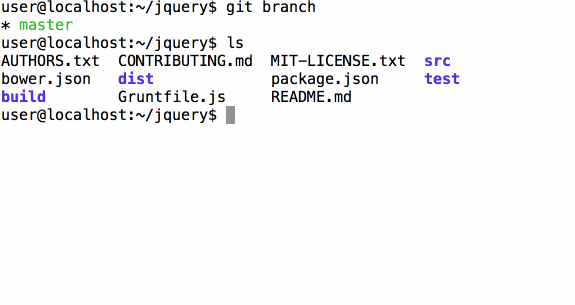
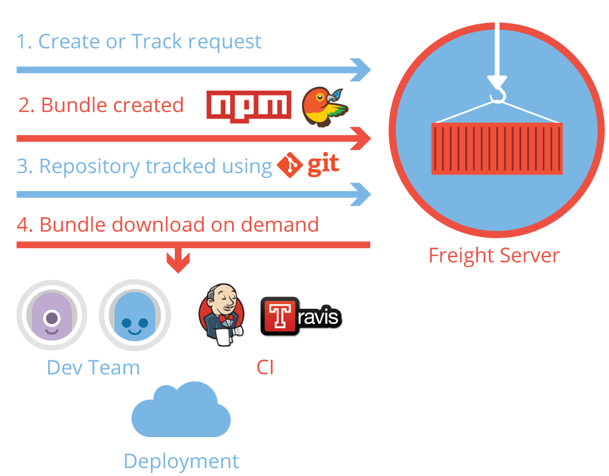

# granary   

> Dependency Bundles for [NPM](https://www.npmjs.org/) and [Bower](http://bower.io/)

Granary helps you:
* Bundle all your dependencies into a compressed archive.
* Avoid committing dependencies into project source.
* Speed up project and dependency installation.
* Speed up continuous integration and deployment.
* Stop relying on NPM and Bower registries.
* Avoid dependency installation issues during deployment.

Granary consists of two components - a tiny command line tool
 and a [Granary Server](https://github.com/gabrielcsapo/grnary-server) that manages the dependencies.

__See the [Granary Documentation](docs/cli.md).__

__See the [Granary Server README](https://github.com/gabrielcsapo/granary-server) to help you setup a Granary Server.__

### Try it out

Install `npm install -g granary`.

Get the sample project:

`git clone https://github.com/gabrielcsapo/granary-sample.git && cd freight-sample`

Run `granary -u http://localhost:8872`, you will now have the NPM and Bower modules!

### Visual Demo

### How it works

Freight supports:
* with NPM: `npm-shrinkwrap.json`, NPM rebuild, production only bundles
* with Bower: `.bowerrc`, Bower resolutions
